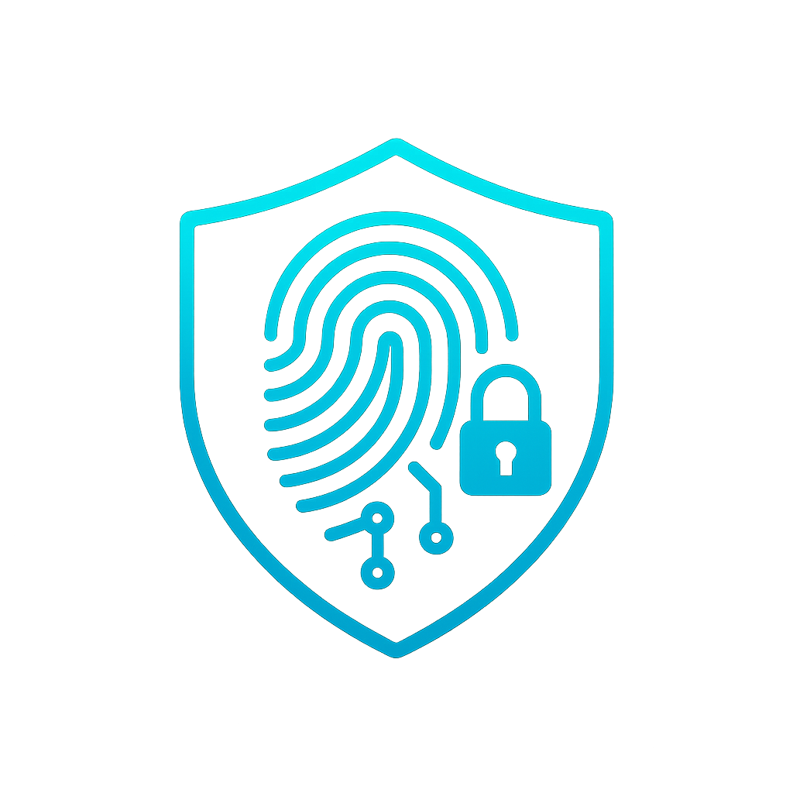

# SecureiOS

[](http://cocoadocs.org/docsets/SecureiOS)
[](http://cocoadocs.org/docsets/SecureiOS)
[](http://cocoadocs.org/docsets/SecureiOS)

SecureiOS is a one-stop framework to implement security features in your iOS Application with minimum efforts requirement.




### Installation
SecureiOS is available through [CocoaPods](https://cocoapods.org/pods/SecureiOS). To install it, simply add the following line to your Podfile:

```ruby
pod "SecureiOS"
```

# Secure UserDefaults
SecureUserDefaults provides you the funtionality to store data in encrypted form. Its a wrapper that allows you to save data as well as retrieve it.

### Usages
#### Save Data
```Swift
SecureiOS.secureUserDefaults().saveData(forKey: "intData", value: intData)
```

#### Get data
```Swift
guard let value = SecureiOS.secureUserDefaults().getAnyData(forKey: "key") as? String else {return}
```

# Safety Features

### JailbreakDetection.
JailbreakDectection method is used to identify if the device is jailbroken. you can simply use below code to get jailbreak status of the device
#### Usages
```Swift
SecureiOS.jailBreakCheck()
```

### Proxy Checker
Attackers always configure decive proxy settings to get configure device for Man In The Middle Attack.You can use this method to identify if the device proxy is configured.
#### Usages
```Swift
 if SecureiOS.proxyCheck() {
    print("Proxy is enabled")
 }
```

### Lock and Biometry check
This method determines if the device has implemented Biometrics or passcode. You can use this method to determince application action based on the results.
#### Usages
```Swift
 let deviceLockAndBiometricStatus = SecureiOS.getDeviceLockAndBiometryStatus()
     
 if deviceLockAndBiometricStatus.isEnabled{
     let type = deviceLockAndBiometricStatus.type
     switch type {
     case .touchId:
        print(type.name)
     case .faceId:
        print(type.name)
     case .passcode:
        print(type.name)
     case .none:
        print(type.name)
     @unknown default:
        print("unknown")
     }
 }
```

### Supported Biomtry types
This method allow your applications to know the device support biometry. You can use this method to determince application action based on the results.
#### Usages
```Swift
switch SecureiOS.getSupportedBiometryType() {
case .faceId:
    print("Face Id")
case .touchId:
    print("Touch Id")
case .none:
    print("None")
@unknown default:
    print("unknown")
}
```

### Application Background Splash Screen Implementation.
iOS takes screenshot of the current views of the app whenever app goes in the background. This screenshot can reveal some sensitive information on the screen which can cause confidentality breach.
You can simply use SetupBackgroundSplashScreen method to implement the app background image of your choice.
#### Usages
```Swift
SecureiOS.setupBackgroundSplashScreen(&window, image)
```
### Emulator Checker
Apps can run on emulator which makes it easier for the hackers to hack the app. The emulator check method identifies if the app is running on an emulator.
you can use below method for the check
#### Usages
```Swift
 if SecureiOS.emulatorCheck() {
    print("Running on simulator")
 }
```

## Author

[Tarun Kaushik](https://www.linkedin.com/in/tarun-kaushik/)

## License

SecureiOS is available under the MIT license. See the LICENSE file for more info.
